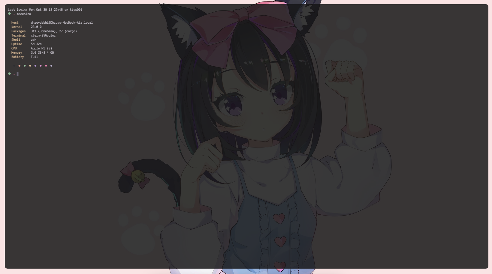

# Dots
This repository contains dotfiles (config files) which I use. 

I use below tools as my goto tools.
1. yabai - a window manager
2. skhd - shortcut tool
3. nvim - text editor
4. alacritty - terminal
5. macchina - cool little thing to see mac's info

